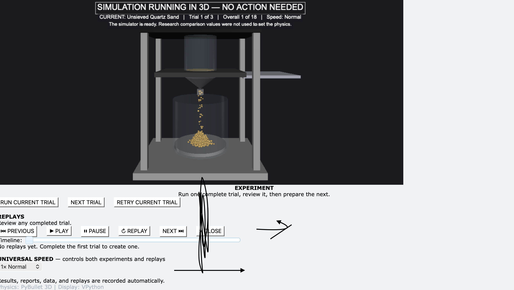

# Angle of Repose Digital Twin

A complete 3D virtual laboratory that runs an angle-of-repose experiment, measures every pile, checks the simulation, and turns the results into reproducible research reports.



## Try it

**[Open the completed interactive research report](https://dillgrammer.github.io/angle-of-repose-digital-twin/)**

**[Download the complete runnable demo](downloads/Angle_of_Repose_Digital_Twin_Full_Demo.zip)**

The download contains both parts of the project:

- A clean simulator that starts at Trial 1. You can run all 18 trials and watch it generate measurements, replays, raw data, a CSV dataset, validation results, and the final report.
- The preserved completed research, so you can inspect the results immediately without waiting for every physics trial to run.

The two parts are separated. Running the clean demo cannot overwrite the completed research.

## Why I built this

I wanted to test whether a digital twin could reproduce a real UCF angle-of-repose study while remaining independent of its answers. Instead of entering the UCF measurements and making the simulator match them, the program sets its material behavior from declared physical assumptions, performs a diagnostic, runs the experiment, and only then compares the results.

This is also a first step toward a larger idea: a reusable system that can turn research procedures into transparent simulations, run checks before publishing results, and clearly report when a result is or is not trustworthy.

## The development story

This started with a real research bottleneck. A friend had spent a full week at UCF working with a professor and team on the physical angle-of-repose experiment. The setup needed fabricated parts, time to clean material out between trials, repeated manual resets, travel, and several people doing different jobs. I wondered whether a digital twin could perform the same experimental sequence faster and more reproducibly—without being told what answer to produce.

My first prototype was a 2D particle model. It looked like a pile, but the pre-validation checks showed that the biggest remaining problem was the physics model itself, not the slope-measurement code. That was an important distinction: improving the graph would not repair unrealistic particle behavior. I restarted the core as a true 3D rigid-body simulation using PyBullet.

The notebook records the first 3D checkpoint as a major improvement: the first material dropped from more than 12% error to under 5%. Other material classes were still too high, especially some sieved quartz and glass-bead runs. I corrected physical inputs such as particle size and contact behavior, not the UCF comparison answers, and kept testing.

Then came the moment written in large letters in my notes: **“A breakthrough has occurred.”** The pre-validator detected that bad data was about to be produced and stopped the simulation before it could present an unreliable angle. That changed the goal from “make an accurate-looking animation” to “build a system that knows when it should not trust itself.” It also led to clearer separation between sieved and unsieved quartz behavior.

The measurement system found another subtle failure. A few particles could roll away from the supported pile and pull a fitted slope too low. I revised the analysis to identify the main pile body, reject isolated runout particles, and compare perpendicular views before accepting a result.

Once the science pipeline worked, the interface became the next experiment. Early builds mentioned caches, showed a red “locked” state during checks, and trapped the user inside the automatic run. My notes correctly predicted that those messages would confuse someone who had not built the project. I replaced them with plain-language diagnostic status, centered and simplified the controls, made each trial automatic after one deliberate **Run Current Trial** click, and restored control after every run.

Replays were the final major interaction problem. Automatic trials saved their data, but initially there was no clear way to move back through completed trials. The finished design uses one organized playback bar with previous/next navigation, play, pause, restart, a timeline, and one speed control shared by live trials and replays.

After roughly 15 hours of research, testing, debugging, and documentation, I completed all 18 trials. The simulation was closer to the selected published benchmark in four of six conditions, while the UCF experiment was closer in two. The two-cup glass-bead result still has a large error. I kept it instead of hiding or rerunning it, because this project is about trustworthy research, not a perfect-looking graph.

### Notebook checkpoints

These were handwritten test checkpoints, not a complete time log:

- **Early prototype:** deliberately added small random variation to represent differences between grains and recorded an initial 15-minute simulation run.
- **Version 4:** an unsuccessful short test—written simply as “I messed up”—that exposed how easy it was for a plausible animation to produce weak research data.
- **Version 6:** identified incorrect glass-bead behavior, symmetry problems, and flawed physical inputs.
- **Pre-validation breakthrough:** the diagnostic refused to run when it detected that unreliable output was likely.
- **First full 3D build:** replaced the 2D solver with PyBullet after validation showed the physics model was the limiting factor.
- **Final usability pass:** fixed automatic-run lock-in, simplified technical language, reorganized the controls, and improved comparisons on the final results page.

Hackatime currently verifies 4.0 hours from the project-specific coding records. I estimate approximately 15 total hours because research, test runs, result review, handwritten planning, and some coding time were not captured by the editor tracker.

### What I learned

- A believable animation is not automatically a defensible measurement.
- A diagnostic should stop questionable results, not quietly search until it finds a preferred one.
- Scientific software needs plain-language controls because usability affects whether people operate an experiment correctly.
- Replays, seeds, raw coordinates, and declared assumptions make a result much easier to audit.
- A digital twin is most useful when it reveals both agreements and failures.

## What the project does

- Runs true 3D rigid-body particle physics with PyBullet.
- Models six quartz-sand and glass-bead conditions with three trials each.
- Requires one deliberate **Run Current Trial** click, then performs and saves that trial automatically.
- Measures the pile from perpendicular views and rejects unsupported geometry.
- Records each random seed, model settings, timing, result, and raw XYZ replay data.
- Provides play, pause, restart, previous/next, timeline, and universal speed controls.
- Generates browser replays, a complete CSV dataset, a diagnostic report, a validation report, and a final research report with graphs.
- Compares the simulation and UCF measurements independently against published experimental benchmarks.

## Completed results

All 18 required trials were completed. The table below compares the means with the declared literature benchmarks used in the final report.

| Material condition | Published benchmark | UCF mean | Simulation mean | Simulation error | UCF error | Closer result |
|---|---:|---:|---:|---:|---:|---|
| Unsieved quartz sand | 32.50° | 29.75° | 32.08° | 1.31% | 8.46% | Simulation |
| Quartz, 125–250 µm | 34.50° | 31.35° | 36.93° | 7.06% | 9.12% | Simulation |
| Quartz, 250–500 µm | 34.00° | 29.68° | 34.74° | 2.18% | 12.72% | Simulation |
| Quartz, >500 µm | 33.00°* | 30.83° | 36.02° | 9.16% | 6.57% | UCF |
| Glass beads, one cup | 22.00° | 19.09° | 21.88° | 0.55% | 13.21% | Simulation |
| Glass beads, two cups | 22.00° | 19.55° | 26.32° | 19.64% | 11.15% | UCF |

The simulation was closer to the selected benchmark in four of the six conditions. This does not make it universally “more accurate”: angle of repose changes with particle shape, roughness, moisture, preparation, and measurement method. The >500 µm condition uses the published 500–1000 µm class as its closest available size match.

## Quick start

### macOS — easiest method

1. Download and unzip the full demo into its own folder.
2. Double-click `RUN_ANGLE_OF_REPOSE.command`.
3. Allow the first launch to create its private Python environment and install the declared packages.
4. Click **Run Current Trial** when the laboratory opens.

The launcher expects Python 3.13. On Apple Silicon it automatically installs the compatible PyBullet package declared in `requirements.txt`.

### Terminal — macOS, Linux, or Windows

```bash
python3.13 -m venv .venv
source .venv/bin/activate && python -m pip install -r requirements.txt
python main.py
```

On Windows, activate the environment with `.venv\\Scripts\\activate` instead of the `source` command.

## Experiment workflow

1. The simulator runs a diagnostic without reading the UCF comparison values.
2. You click **Run Current Trial**.
3. Particles release under gravity, settle, and form a pile in 3D.
4. The measurement system checks the pile from perpendicular views.
5. The trial result, seed, settings, raw coordinates, and replay are saved automatically.
6. You review the result and choose **Next Trial**.
7. After the full experiment, the project generates the research and validation reports.

## Scientific safeguards

- UCF comparison measurements are not used to tune trial physics.
- Every one-cup condition uses the same normalized material volume; the two-cup condition uses twice that volume.
- Quartz conditions share one contact model, while both glass-bead conditions share another.
- Particles are released by gravity without artificial horizontal launch velocity.
- Measurement rejects isolated runout particles and requires agreement between perpendicular views.
- The program does not silently retry an invalid result, which helps avoid cherry-picking successful trials.
- Every completed trial retains enough settings and replay data for inspection and reproduction.

## How the technical system is organized

- `main.py` contains the PyBullet physics, VPython laboratory, experiment controller, measurement logic, replay system, and report generation.
- `RUN_ANGLE_OF_REPOSE.command` creates an isolated environment and launches the simulator on macOS.
- `requirements.txt` declares the platform-specific PyBullet package, VPython, and supporting package versions.
- `index.html` is the public completed research report used by GitHub Pages.
- `completed_research/` preserves the exact reports, CSV, 18 visual replays, and raw XYZ replay data from the finished experiment.

## Completed research files

- [`Main research report`](completed_research/01_MAIN_RESEARCH_REPORT.html)
- [`Complete trial data and settings`](completed_research/02_COMPLETE_TRIAL_DATA_AND_SETTINGS.csv)
- [`Simulation validation and accuracy report`](completed_research/05_SIMULATION_VALIDATION_AND_ACCURACY.html)
- [`Visual browser replays`](completed_research/03_VISUAL_REPLAYS_OPEN_THESE/)
- [`Raw reproducibility data`](completed_research/04_RAW_REPLAY_DATA_FOR_REPRODUCIBILITY/)
- [`Simulator diagnostic report`](completed_research/00_SIMULATOR_DIAGNOSTIC_REPORT.html)

## Technology

- Python 3.13
- PyBullet for true 3D rigid-body physics
- VPython for the interactive laboratory and controls
- HTML Canvas for graphs and portable browser replays
- CSV and JSON for inspectable research and reproducibility data

## Limitations and next steps

This is a serious simulation, but not a substitute for additional physical experiments. Quartz grains are represented through a sphere-based contact model rather than scanned irregular grain geometry, each condition currently has three trials, and published comparisons do not perfectly match every material source and test method. The next research version should use newer matched literature, more repetitions, measured particle-shape distributions, uncertainty intervals, and calibration against separate physical training data before a blinded validation set.

## AI-use disclosure

I used OpenAI Codex extensively to generate and revise Python and HTML, debug the physics and interface, implement validation and replay features, and prepare documentation. I defined the research goal and experimental conditions, directed the workflow, ran and reviewed the trials, identified problems, evaluated the results, and made the final product decisions. This project is presented as AI-assisted work, not as unaided code.

## License

Released under the [MIT License](LICENSE).
